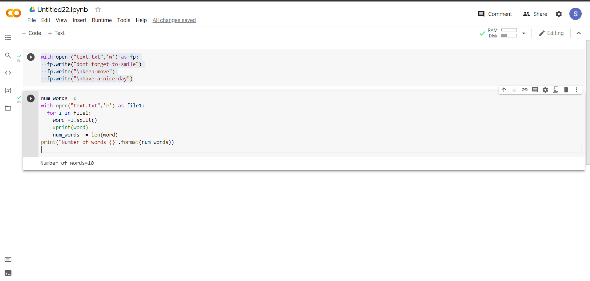

# Word-count
## AIM:
To write a python program for getting the word count from a text.
## EQUIPEMENT'S REQUIRED: 
PC
Anaconda - Python 3.7
## ALGORITHM: 
### Step 1:
 open text.txt as fp
### Step 2: 
 add content to the text.txt file
### Step 3: 
 use reas mode to read the text.txt
### Step 4:  
 split the words in the file using split()
### Step 5: 
 use len(word) to find total number of words
### Step 6: 
 print the output
## PROGRAM:

## CONTENT IN THE FILE
```
Developed by:Sithi hajara I
 Reference number:21500125
 
with open ("text.txt",'w') as fp:
  fp.write("dont forget to smile")
  fp.write("\nkeep move")
  fp.write("\nhave a nice day")


num_words =0
with open("text.txt",'r') as file1:
  for i in file1:
    word =i.split()
    #print(word)
    num_words += len(word)
print("Number of words={}".format(num_words))    
```
### OUTPUT:




## RESULT:
Thus the program is written to find the word count from a text.
